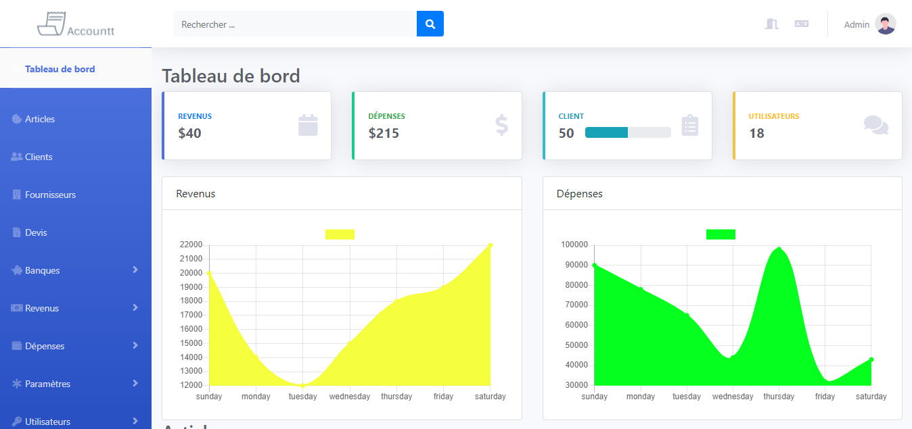

## Introduction

Accountt is an application that provides its user with a suite of tools intended to control and manage all financial operations of companies, including banking transactions, income and expenses.

## Informations
-   Status: under development
-   Lastest version 1.0
-   Sector: finance
-   Created: December 2020
-   Last updated: December 2020

## Table of contents
* [Documentation](#general-info)
* [Demo](#demo)
* [Screenshots](#screenshots)
* [Technologies](#technologies)
* [Setup](#setup)
* [Features](#features)
* [Status](#status)
* [Contact](#contact)
* [License](#license)

## Documentation
https://github.com/aniskchaou/ACCOUNTT-FRONTEND-ADMIN/wiki

## Demo
https://accountt.herokuapp.com/dashboard

## Screenshots

## Technologies
* Spring boot
* Angular

## Setup

## Features
 -  Manage income and expense invoices
-   Manage different users and distribute tasks
-   Manage customers and suppliers
-   Manage different products and services
-   Classify accounts
-   Instantly manage income and expenses
-   Prepare quotes

  

## Contact
contact@delta-dev-software.com

## License
<a href="license.txt">MIT License</a>